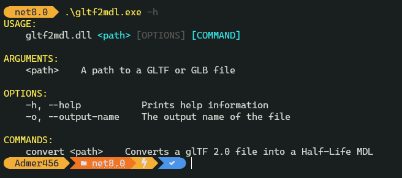

> [!NOTE]\
> This is a very early work in progress! There are no downloadable executables just yet. Stay tuned.

# gltf2mdl

Converts glTF 2.0 models into Half-Life MDL.

**Setup:** Download or compile the app, and place `studiomdl.exe` right next to `gltf2mdl.exe`  
**Usage:** Drag'n'drop your glTF models onto `gltf2mdl.exe`, or use it via the commandline

## Download

None available at the moment.

## Screenshots

